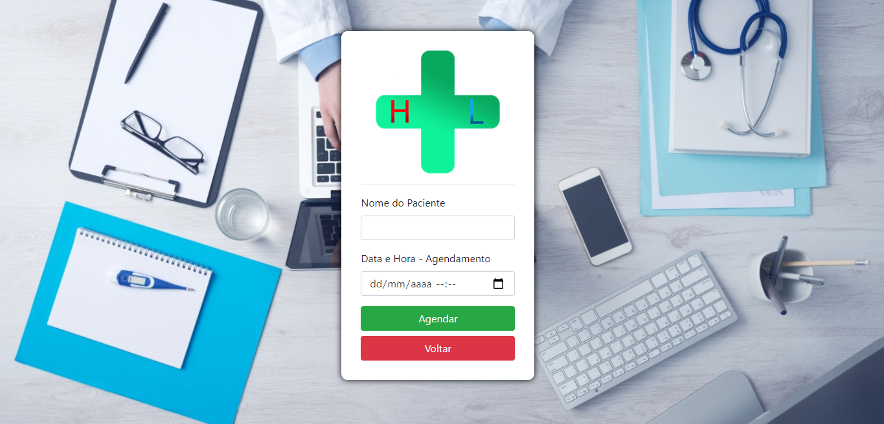

# Bem-vindo à documentação do nosso TCC!

## Trabalho de conclusão de curso em Desenvolvimento de Sistemas na ETEC.
__________
### Feito por:
[Arnaldo](https://github.com/naldofranca86) - Front-end + ideias\
[Emanoel](https://github.com/emanoteste) - Documentação + ideias\
[Lucas Uriel](https://github.com/Uriel-6l6) - Estruturação do Banco de Dados\
[Gerson](https://github.com/Gersomonio) - Front-end + Back-end
__________
- ### Nossa experiência com o Projeto:
O intuito de nosso projeto era realizar uma aplicação com tecnologias não ensinadas na instituição para que pudéssemos provar aos professores e a nós mesmos que conseguiriamos nos aprofundar em outras tecnologias com a lógica ensinada no curso (Thanks, Barth and Alex!).

A ideia era fazer um sistema CRUD junto com um gerador de PDF para uma consulta nutricional.

Nosso maior desafio foi aprender as tecnologias não ensinadas citadas anteriormente, tais como: [Javascript](https://www.javascript.com), [NodeJS](https://nodejs.org/en/), [Handlebars](https://handlebarsjs.com) e  [Bootstrap](https://getbootstrap.com).

________
## A aplicação:

- **Tela de Login:**\
Na tela de login temos um formulário padrão onde são inseridas as credenciais do usuário pré-definidas para que seja possível o acesso:\
\

________
- **Tela Home:**\
Na tela Home o usuário deverá escolher entre as 5 opções: Agendamento de consultas, Ver agendamentos, Cadastrar novo cliente, Gerenciar clientes e Sair:\
\

________
- **Tela de Agendamento:**\
Na tela de agendamento são inseridos o nome do paciente e a data da consulta através do formulário:\
\
\
*Nota: É recomendado cadastrar o cliente antes de realizar o agendamento.*
_______
- **Tela de Ver Agendamentos:**\
Na tela de Ver Agendamentos é possível ver em uma tabela todos os agendamentos marcados e é possível marcá-los como atendido ou cancelar, também é possível editar e gerar um documento de Anamnese:\

________
- **Tela de Gerar Documento:**\
Na tela de gerar documento, citado na tela de ver agendamentos, é possível inserir informações e gerar o PDF (para isso usamos o [pdfmake](http://pdfmake.org)):\

**Exemplo de Documento Gerado:**

_______
- **Tela de Cadastrar Clientes:**\
Na tela de cadastrar clientes temos um formulário para inserção de informações a serem salvas no banco de dados:

_______
- **Tela de Gerenciar Clientes:**\
Na tela de gerenciar clientes é possível ver todos os clientes cadastrados e também editar suas informações ou excluí-los do banco:

_______
## Considerações finais:

Acreditamos que esse projeto tenha sido um bom desafio, pois tivemos que estudar por fora para que ele pudesse ter sido realizado. Obrigado por ter lido até aqui!
